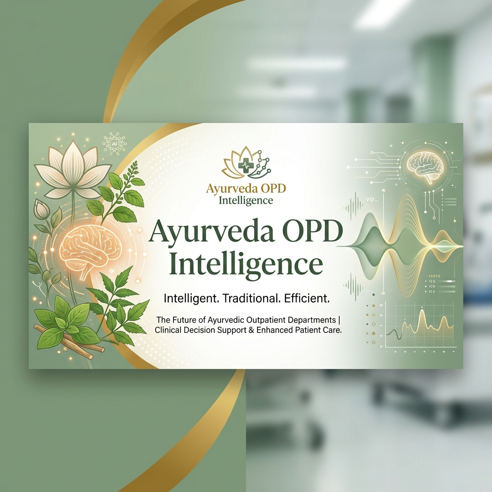

# 🌿 Ayurveda OPD Intelligence



[](https://github.com/DeepakChauhanAI/OPD-Intelligence/blob/main/LICENSE)
[](https://github.com/DeepakChauhanAI/OPD-Intelligence/stargazers)
[](https://github.com/DeepakChauhanAI/OPD-Intelligence/issues)
[](https://fastapi.tiangolo.com)
[](https://reactjs.org)
[](https://ai.google.dev/)

**Ayurveda OPD Intelligence** is a production-grade, voice-first AI assistant designed to digitize the complete outpatient workflow for Ayurvedic practitioners. By combining real-time audio streaming via the **Gemini Multimodal Live API** with structured clinical data extraction, it allows doctors to focus on patients while the AI handles the documentation.

---

## ✨ Key Capabilities

- 🎙️ **Real-time Voice Intake**: Conducts structured patient interviews in English, Hindi, and Hinglish.
- 🩺 **Clinical Data Extraction**: Automatically identifies symptoms, duration, severity, and dosha imbalances.
- ✍️ **Doctor Dictation**: Converts unstructured doctor speech into standardized clinical notes and prescriptions.
- 🚨 **Red Flag Detection**: Built-in safety net to identify emergency symptoms immediately.
- 📊 **Patient Progress Tracking**: Monitors daily wellness through structured voice/text check-ins.
- 💾 **Persistent Storage**: Full data persistence using SQLite, ensuring zero data loss across sessions.

---

## 🚀 Quick Start

### Prerequisites
- Python 3.9+
- Node.js 18+
- Google Gemini API Key

### 1. Clone the Repository
```bash
git clone https://github.com/DeepakChauhanAI/OPD-Intelligence.git
cd OPD-Intelligence
```

### 2. Setup Backend
```bash
# Install dependencies
pip install -r requirements.txt

# Configure environment
# Create a .env file and add your GEMINI_API_KEY
echo "GEMINI_API_KEY=your_key_here" > .env

# Start the FastAPI server
python server.py
```

### 3. Setup Frontend
```bash
# Install dependencies
npm install

# Start the development server
npm run dev
```

The app will be available at `http://localhost:5173`.

---

## 🛠️ Tech Stack

| Component | Technology |
| :--- | :--- |
| **Frontend** | React 19, TypeScript, Tailwind CSS v4, Zustand |
| **Backend** | FastAPI, Python, WebSockets, aiosqlite |
| **AI Models** | Gemini 2.0 Flash (Live Audio), Gemini 1.5 Flash (Text Extraction) |
| **Database** | SQLite (Single-file, no external setup required) |

---

## 📐 System Architecture

The application follows a modern decoupled architecture:
1. **React Client**: Thin client handling audio I/O and state. No API keys exposed.
2. **FastAPI Server**: Secure bridge for WebSockets and REST API. Manages database and LLM calls.
3. **Gemini Live API**: Handles bidirectional real-time audio streaming.
4. **SQLite Database**: Local persistence for patients, intakes, dictations, and transcripts.

---

## 📄 License

This project is licensed under the MIT License - see the [LICENSE](LICENSE) file for details.

---

## 🤝 Contributing

Contributions are welcome! Please feel free to submit a Pull Request.

---

Developed with ❤️ for the Ayurvedic community.
